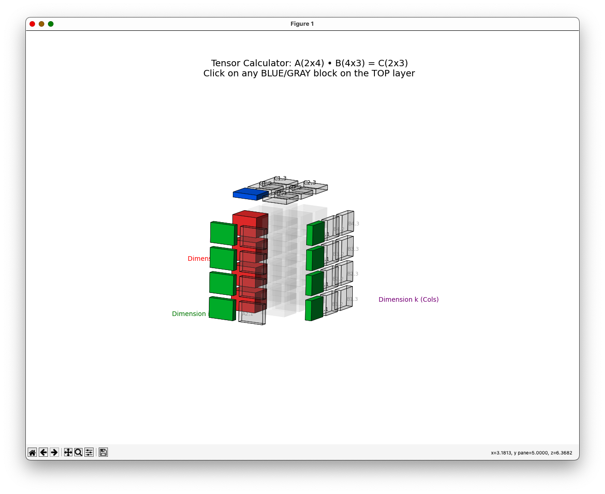

# TensorGlass: Interactive 3D Matrix Multiplication

**TensorGlass** is a Python-based educational tool that visualizes Matrix Multiplication ($C = A \times B$) as a 3D Tensor Contraction. 

Unlike standard 2D grid visualizations, this tool renders the operation as a "Glass Cube," allowing you to see the "hidden dimension" of summation ($j$) that occurs when calculating every cell of the result matrix.



## ✨ Features

* **Calculator Mode:** Define your own dimensions ($I \times J$, $J \times K$) at runtime. The visualization scales automatically.
* **3D "Glass" Esthetic:** Uses transparency to show the internal structure of the tensor without visual clutter.
* **Interactive Learning:** * Click on any element in the Result Matrix ($C$) on the top layer.
    * **Blue:** The selected result element.
    * **Green:** Highlights the specific row of $A$ and column of $B$ required for the calculation.
    * **Solid Red:** Reveals the vertical "fiber" inside the cube where the summation $\sum_j$ takes place.
* **Zero Dependencies (Heavy):** Built entirely with standard `numpy` and `matplotlib`.

## 🧮 The Visual Logic

Matrix multiplication is often taught as "row times column." In tensor notation, it is a contraction over the index $j$:

$$C_{i,k} = \sum_{j} A_{i,j} \times B_{j,k}$$

In this 3D visualization:
1.  **Axis $x$ (Dimension $i$):** Rows of Matrix $A$.
2.  **Axis $y$ (Dimension $k$):** Columns of Matrix $B$.
3.  **Axis $z$ (Dimension $j$):** The **summation depth**. This is the vertical axis inside the cube. 

When you click a result $C_{i,k}$, the tool highlights the specific vertical column (fiber) inside the cube that corresponds to the dot product calculation.

## 🚀 Getting Started

### Prerequisites

You need Python installed along with `matplotlib` and `numpy`.

```bash
pip install matplotlib numpy